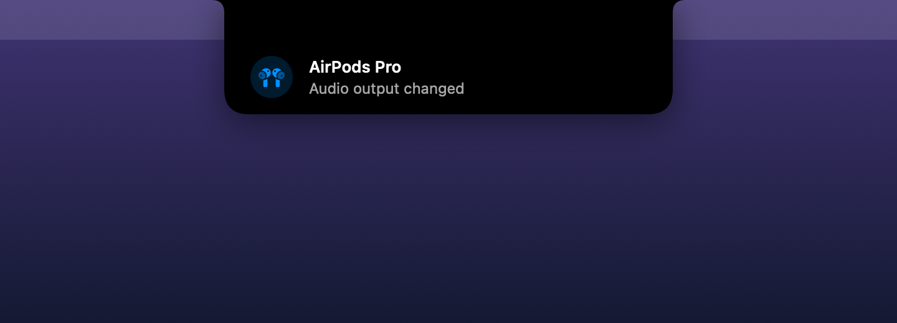

<p align="center">
  
</p>

<h1 align="center">NotchIsland</h1>

<p align="center">
  A Dynamic Island for the Mac notch. Native Swift, Apple Silicon only, open source.<br>
  On Macs without a notch it draws a virtual one, so every Mac gets an island.
</p>

---

## What it shows

| | |
|---|---|
| **Now playing:** Spotify, Apple Music, YouTube Music and Spotify Web (browser / PWA). Includes cover art, progress, seek, play/pause, next and previous. |  |
| **Volume and brightness.** Replaces the system HUD (optional). <kbd>⇧</kbd><kbd>⌥</kbd> gives fine steps. |  |
| **Notifications.** A new badge on a Dock app (WhatsApp, Mail, Messages, Telegram…) pops up in the island. |  |
| **Charging, low battery, AirPods / audio output changes** |  |
| **No notch? No problem.** External displays and notch-less Macs get a virtual island. |  |

Hover over the notch to expand it. Click it to toggle.

## Install

Requirements: an Apple Silicon Mac (M1 or newer), macOS 14 Sonoma or later, and Xcode or the Command Line Tools.

```bash
git clone https://github.com/<you>/NotchIsland.git
cd NotchIsland
./scripts/build.sh
open build/NotchIsland.app
```

To keep it, move `build/NotchIsland.app` to `/Applications`. Then turn on **Launch at login** from the menu bar icon → Settings.

> Tip: `SIGN_IDENTITY="Apple Development: Your Name (TEAMID)" ./scripts/build.sh` signs the app with your own certificate.
> macOS then keeps the granted permissions across rebuilds. Ad-hoc builds need permissions granted again after every rebuild.

## Permissions and security

NotchIsland is built to be safe to run:

- **No network, no analytics, no tracking.** The only network request downloads Spotify cover art from Spotify's own CDN (`*.scdn.co`, HTTPS).
- **No private-entitlement hacks.** It does not inject code into system processes or bypass macOS protections. It uses only public, documented mechanisms:
  - Spotify and Music: their official AppleScript interfaces and distributed notifications.
  - Browsers: it reads only the **URL and title** of `music.youtube.com` / `open.spotify.com` tabs. It never runs JavaScript in your browser.
  - Playback control for browser players: the standard media keys.
- **Hardened runtime**, and the source is small enough to read in one sitting.

| Permission | Why | Required? |
|---|---|---|
| **Accessibility** | Catch the volume and brightness keys (to replace the system HUD), read Dock badges | Optional. Without it you still get music and a volume HUD on top of the system one. |
| **Automation** (Spotify / Music / browser) | Read the current track and control playback | Asked once per app on first use |

## How it works

| Component | Implementation |
|---|---|
| Island window | Borderless non-activating `NSPanel` above the menu bar. Click-through outside the island. Never steals focus. |
| Notch size | `NSScreen.safeAreaInsets` + `auxiliaryTopLeft/RightArea` (falls back to a virtual notch) |
| Volume | CoreAudio (`VirtualMainVolume`, mute) + property listeners |
| Brightness | DisplayServices (built-in display) |
| Media keys | `CGEventTap` for volume/brightness keys only. Other keys pass through untouched. |
| Battery | IOKit power-source notifications |

Rendering previews (used for the images above):

```bash
swift build -c release && .build/release/NotchIsland --render-previews previews
```

## Known limitations

- macOS offers no public API for other apps' notification content. NotchIsland therefore shows **badge counts**, not message text.
- For browser players the play/pause state is inferred. Seeking is only available for Spotify and Apple Music desktop apps.
- Intel Macs are not supported.

## Türkçe

**NotchIsland**, Mac'teki çentiği iPhone'daki Dinamik Ada'ya çeviren, açık kaynak ve tamamen yerel çalışan bir uygulama. Çentiği olmayan Mac'lerde ve harici ekranlarda sanal bir ada çizer.

- **Müzik:** Spotify, Apple Music, YouTube Music, Spotify Web. Kapak, ilerleme çubuğu, ileri sarma ve oynat/duraklat/sonraki/önceki kontrolleri var.
- **Ses ve parlaklık:** Sistem göstergesinin yerine geçer. <kbd>⇧</kbd><kbd>⌥</kbd> ile ince ayar yapılır.
- **Bildirimler:** Dock'taki uygulamalara (WhatsApp, Mail, Telegram…) yeni rozet gelince adada görünür.
- **Pil, şarj, AirPods / ses çıkışı değişimi**

Kurulum: `./scripts/build.sh` → `open build/NotchIsland.app`. Sadece Apple Silicon ve macOS 14+.

Güvenlik: İnternete veri göndermez. Sistem süreçlerine kod enjekte etmez. Sadece Apple'ın resmi mekanizmalarını kullanır.

## License

[MIT](LICENSE)
