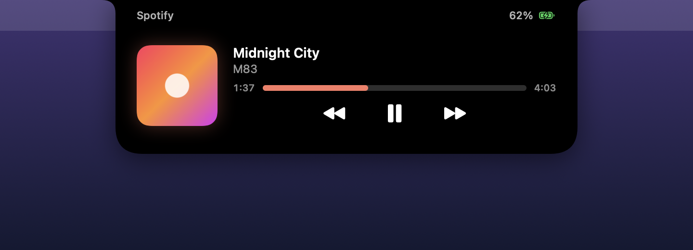
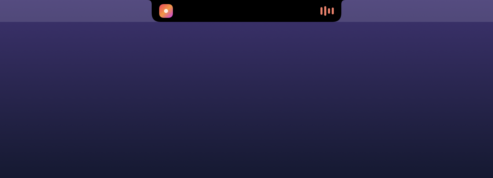
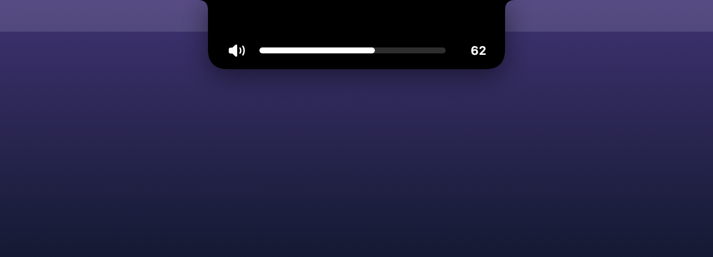
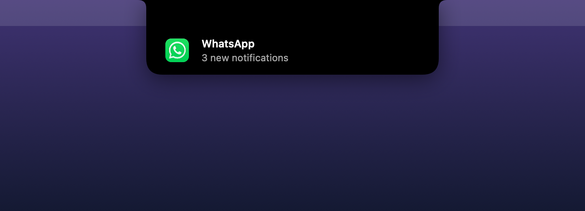
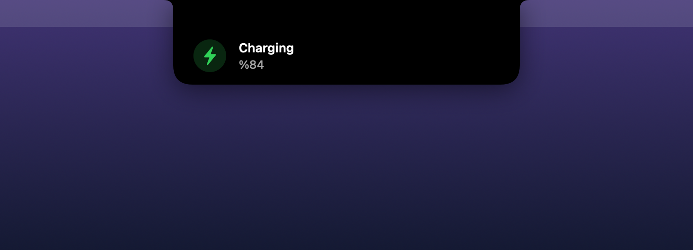

<p align="center">
  
</p>

<h1 align="center">NotchIsland</h1>

<p align="center">
  Mac'inin çentiği için Dinamik Ada: müzik, ses, parlaklık, bildirimler, pil.<br>
  Çentiği olmayan Mac'lerde de çalışır.
</p>

<p align="center">
  <a href="https://github.com/sarp07/NotchIsland/releases/latest/download/NotchIsland.zip"></a>
</p>

<p align="center"><a href="README.md">English</a> · <b>Türkçe</b></p>

---

## Özellikler

- 🎵 **Müzik:** Spotify, Apple Music, YouTube Music, Spotify Web. Kapak resmi ve oynatma kontrolleri.
- 🔊 **Ses ve parlaklık:** Sistemin açılır göstergesi yerine adada görünür.
- 🔔 **Bildirimler:** WhatsApp, Mail, Telegram… uygulamalarına yeni rozet gelince adada çıkar.
- 🔋 **Pil ve AirPods:** Şarj, düşük pil, kulaklık bağlandı.
- 💻 **Çentik yok mu? Sorun değil.** Ekranın üstünde sanal bir ada belirir.

Üzerine gelince ada genişler. Tıklayınca açılıp kapanır.

<p align="center">
  
  
  
  
</p>

## Kurulum

Gereksinimler: **Apple Silicon** (M1 veya daha yeni) bir Mac ve **macOS 14** ya da üstü.

### Yöntem 1: İndir (en kolayı)

1. [**NotchIsland.zip dosyasını indir**](https://github.com/sarp07/NotchIsland/releases/latest/download/NotchIsland.zip) ve aç.
2. `NotchIsland.app` dosyasını **Uygulamalar** klasörüne sürükle ve aç.

Uygulama Apple tarafından imzalanmış ve onaylanmıştır (notarized). Diğer uygulamalar gibi doğrudan açılır.

### Yöntem 2: Kaynaktan derle

```bash
git clone https://github.com/sarp07/NotchIsland.git
cd NotchIsland
./scripts/install.sh
```

"Command Line Tools are required" hatası görürsen önce `xcode-select --install` komutunu çalıştır.

## İlk açılış

1. Menü çubuğundaki **kapsül ikonuna** tıkla → **Ayarlar**.
2. **Erişilebilirlik** izni ver. Ses/parlaklık tuşları ve bildirimler için gerekli.
3. Müzik ilk çaldığında macOS, NotchIsland'ın Spotify / Müzik / tarayıcını kontrol etmesi için izin ister. **Tamam**'a bas.
4. İstersen **Girişte başlat** seçeneğini aç.

## Gizlilik

- Hiçbir yere **veri göndermez**: analitik yok, takip yok. Tek ağ isteği Spotify kapak resmidir.
- Sadece macOS'un resmi özelliklerini kullanır. Başka uygulamalara kod enjekte etmez, sistem güvenliğini atlatmaz.
- Tarayıcında yalnızca YouTube Music / Spotify sekmelerinin **başlığını ve adresini** okur. Başka hiçbir şeyi okumaz.

## Bilmen gerekenler

- macOS, uygulamaların diğer uygulamaların bildirim metnini okumasına izin vermiyor. Ada bunun yerine **yeni bildirim sayısını** gösterir, örneğin "WhatsApp · 3 yeni bildirim".
- Tarayıcıdaki oynatıcılarda ileri sarma yapılamaz.
- Intel Mac'ler desteklenmiyor.

## Kaldırma

Menü çubuğu ikonundan çık, sonra `/Applications/NotchIsland.app` dosyasını sil.

## Lisans

[MIT](LICENSE) © solazan
